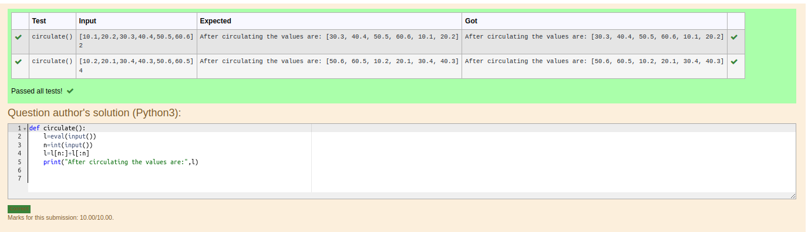

# Circulate-the-values-of-N-variables
## Aim:
To write a python program to circulate the n variables using function concept
## Equipment’s required:
PC
Anaconda - Python 3.7
## Algorithm: 
### Step 1: 
Import def circulate.
### Step 2: 
Prepare the lists from each linear equations and assign in np.array().
### Step 3: 
Get the value from the user for the number of rotation
### Step 4: 
Using the slicing concept rotate the list
### Step 5: 
Add coding to the input value.
### Step 6: 
Print the coding to get answer.
## Program:
Program to circulate N values.

Developed by: Mohamed Nadheem N

RegisterNumber:23014217
```python

def circulate():
    list1=eval(input())
    n=int(input())
    result=list1[n:]+list1[:n]
    print("After circulating the values are:",result)    
```

## Output:



## Result:
Thus circulating the values of N variables using python program successfully executed

